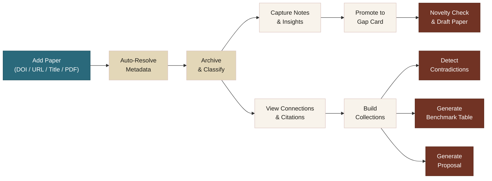
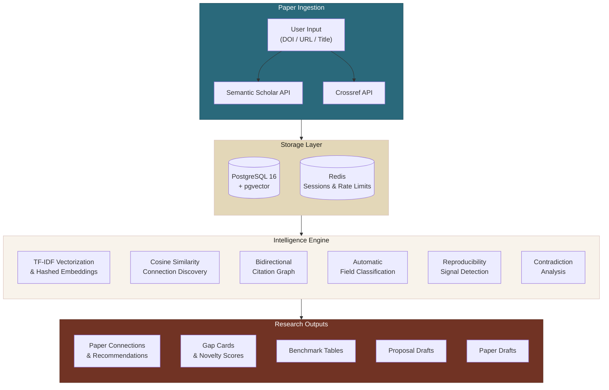
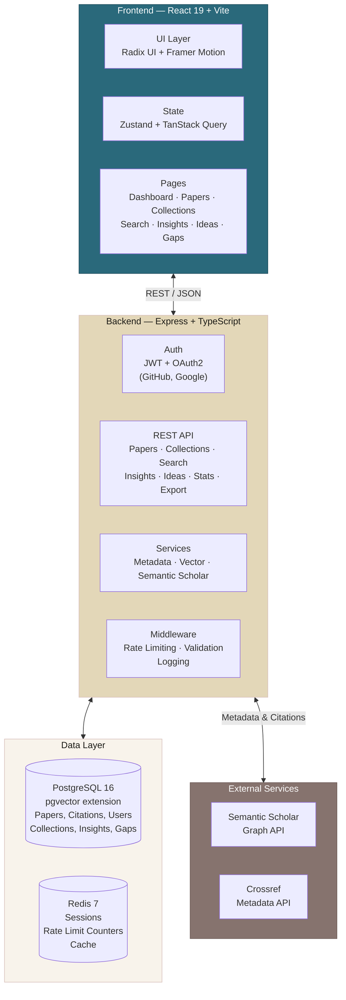

<h3 align="center"><em>Where knowledge finds its shape.</em></h3>

<p align="center">
  The research intelligence platform that turns your reading into a living knowledge graph.
</p>

<p align="center">
  <a href="#features"><strong>Features</strong></a> · <a href="#how-it-works"><strong>How It Works</strong></a> · <a href="#architecture"><strong>Architecture</strong></a> · <a href="#getting-started"><strong>Get Started</strong></a> · <a href="#roadmap"><strong>Roadmap</strong></a> · <a href="#contributing"><strong>Contributing</strong></a>
</p>

<p align="center">
  
  
  
  
  
  
  
</p>

---

## The Problem

Researchers today juggle five or six disconnected tools just to keep up with the literature. Reference managers store citations but don't think about them. Note-taking apps capture insights but leave them stranded. Discovery engines surface papers but forget what you've already read. And when it's time to write a literature review, a research proposal, or simply answer "what have I missed?" — you're back to square one.

**Aether closes this gap entirely.** It is the first open-source platform that unifies paper tracking, semantic search, citation mapping, insight capture, contradiction detection, reproducibility scoring, and research proposal generation into a single, intelligent workspace.

---

## Features

### Intelligent Paper Ingestion
Add papers by DOI, URL, title, or PDF upload. Aether automatically resolves complete metadata — title, authors, abstract, venue, year, citation count — from Semantic Scholar and Crossref. Duplicate detection prevents redundant entries. Field classification happens automatically across 10+ research domains.

### Semantic Connection Discovery
Every paper is embedded as a vector and stored using pgvector. When you open any paper, Aether computes cosine similarity across your entire archive and surfaces related work — ranked by confidence score. No external AI API required. No configuration. It just works.

### Citation Graph Mapping
Aether fetches up to 50 forward citations and 50 backward references per paper from the Semantic Scholar graph. Both directions are linked in the database. When a cited paper exists in your archive, it becomes a first-class navigable relationship.

### Research Gap Tracker
A structured hypothesis board. Create gap cards from scratch or promote any insight into a research question. Track hypotheses, required datasets, baselines, and risks through a lifecycle: `idea` → `validating` → `running` → `done`. Run novelty checks against your archive. Generate structured paper drafts from any gap card.

### Contradiction Detection
Pairwise analysis across an entire collection to find papers that disagree. Aether identifies shared conceptual terms, then detects opposing polarity signals. Results are ranked by confidence and surfaced as an automatically generated conflict map.

### Method Benchmark Tables
Auto-generated comparison tables for any collection — task, dataset, metrics, model family, compute budget, limitations, and failure modes — extracted from metadata and abstracts. The literature review table, without manual data entry.

### Proposal Generation
One-click structured research proposals from any collection. Aether analyzes thematic keywords, dominant fields, and contributing venues to generate a complete proposal with motivation, prior work, hypotheses, methodology, and expected contributions.

### Reproducibility Scoring
Every paper receives a reproducibility card scored across four dimensions: code availability, dataset access, environment documentation, and model checkpoints. Signals are extracted automatically from abstracts, titles, and URLs. Each card shows a 0–100 score and a list of missing artifacts.

### Academic Radar
Personalized paper recommendations powered by Semantic Scholar, based on your most recently added papers. Trending discoveries appear on your dashboard and can be imported into your archive with a single click.

### Collections, Notes, Insights, Ideas
Organize papers into named collections. Capture rich-text notes and timestamped insights per paper. Maintain a workspace of research ideas linked to source papers — each with a lifecycle from brainstorm to published.

### Gamified Reading Statistics
Track papers read, active reading streaks, fields explored, and weekly trends over rolling 12-week windows. Earn achievement badges at milestones. Stay motivated with visible progress.

### Full Data Export
Export your complete archive — papers, notes, insights, ideas, collections — in JSON or CSV. Export individual collections or your full dataset.

---

## How It Works

### User Workflow



### Data Flow



---

## Architecture



### Tech Stack

| Layer | Technology |
|-------|-----------|
| Frontend | React 19, Vite, TypeScript, Zustand, TanStack Query, Framer Motion, Recharts, Radix UI |
| Backend | Node.js, Express, TypeScript, Passport.js (JWT + OAuth2) |
| Database | PostgreSQL 16 with pgvector, Redis 7 |
| External APIs | Semantic Scholar, Crossref |
| Infrastructure | Docker Compose |

---

## Getting Started

### Prerequisites

- Node.js >= 18
- Docker & Docker Compose
- Git

### Quick Start

```bash
# Clone the repository
git clone https://github.com/codewithadvi/Aether.git
cd Aether

# Install dependencies
npm run install:all

# Start infrastructure (PostgreSQL + Redis)
docker compose up -d

# Run database migrations
npm run migrate

# Start the application
npm run dev
```

The frontend will be available at `http://localhost:5173` and the API at `http://localhost:3001`.

---

## Project Structure

```
aether/
├── src/                    # Frontend source
│   ├── pages/              # Application pages
│   │   ├── DashboardPage   # Reading stats, trends, academic radar
│   │   ├── PapersPage      # Paper archive with search & filters
│   │   ├── PaperDetailPage # Full paper view with citations, notes, insights
│   │   ├── CollectionsPage # Collection management
│   │   ├── SearchPage      # Deep search across archive
│   │   ├── InsightsPage    # Insight browser
│   │   ├── IdeasPage       # Research idea workspace
│   │   ├── GapTrackerPage  # Hypothesis tracking board
│   │   └── DatasetsPage    # Dataset analysis
│   ├── components/         # Shared UI components
│   ├── stores/             # Zustand state stores
│   └── lib/                # API client & utilities
├── backend/
│   └── src/
│       ├── routes/         # API route handlers
│       ├── services/       # Metadata, vector, Semantic Scholar services
│       ├── middleware/      # Auth, rate limiting, validation
│       ├── models/         # Database models
│       └── db/             # Migrations & connection pool
├── docker-compose.yml      # PostgreSQL + Redis
└── package.json
```

---

## Roadmap

- [x] Paper ingestion with auto-metadata resolution
- [x] Semantic vector connections via pgvector
- [x] Bidirectional citation graph from Semantic Scholar
- [x] Research Gap Tracker with novelty scoring
- [x] Contradiction detection across collections
- [x] Auto-generated benchmark comparison tables
- [x] One-click research proposal generation
- [x] Reproducibility scoring engine
- [x] Paper draft generation from gap cards
- [x] Academic Radar with personalized recommendations
- [x] Achievement system and gamified statistics
- [x] OAuth2 authentication (GitHub, Google)
- [x] Full data export (JSON, CSV)
- [ ] Collaborative collections with shared annotations
- [ ] PDF viewer with in-document highlights
- [ ] Citation graph visualization (interactive node map)
- [ ] Knowledge graph exploration mode
- [ ] Zotero and Mendeley import
- [ ] Browser extension for one-click paper capture
- [ ] AI-powered research question generation
- [ ] Weekly email digest of field activity

---

## Contributing

Contributions are welcome and appreciated. Whether it's a bug fix, a feature request, or a documentation improvement — every contribution helps make Aether better for the research community.

1. Fork the repository
2. Create your feature branch (`git checkout -b feature/your-feature`)
3. Commit your changes (`git commit -m 'Add your feature'`)
4. Push to the branch (`git push origin feature/your-feature`)
5. Open a Pull Request

Please read the [Code of Conduct](CODE_OF_CONDUCT.md) before contributing.

---

## License

This project is licensed under the MIT License. See [LICENSE](LICENSE) for details.

---

<p align="center">
  <strong>Aether</strong> — Where knowledge finds its shape.
  <br />
  <sub>Built for researchers, by researchers.</sub>
</p>
